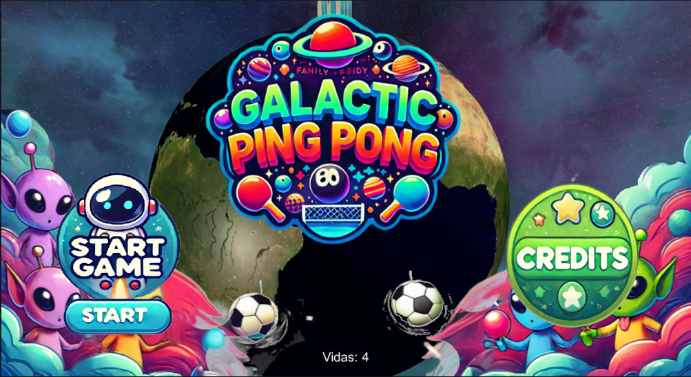
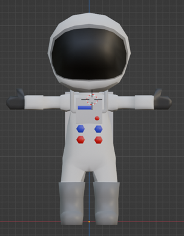
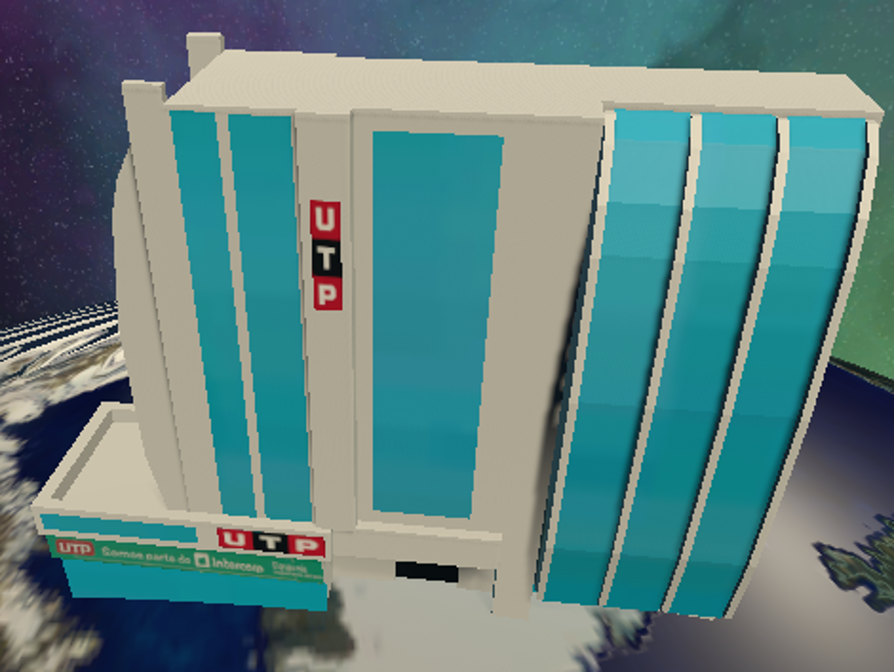
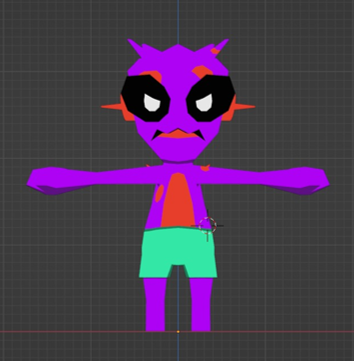
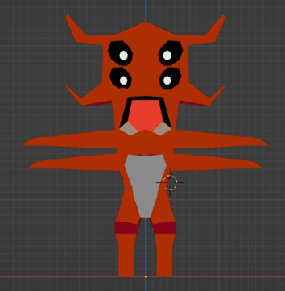

# Galactic Pong 3D

**Galactic Pong 3D** es un emocionante juego de fútbol en 3D inspirado en el clásico pong del PlayStation 1. El juego presenta un astronauta como protagonista que se enfrenta a alienígenas en una serie de partidos de fútbol galáctico. Diseñado como trabajo final para el curso de Desarrollo de Videojuegos 2 de la Universidad Tecnológica del Perú, el objetivo es superar cada nivel, aumentando en dificultad y velocidad, con un total de 4 vidas para completar el juego.

## 🎮 Descripción del Juego

- **Niveles**: 3
- **Objetivo**: Acumular 5 puntos por nivel para avanzar al siguiente
- **Vidas**: 4
- **Controles**: Control de voz o teclado
- **Ambientación**: Galáctica con elementos clásicos de ping pong

El juego promueve la accesibilidad e inclusión al permitir el uso de comandos de voz para maniobrar. Los jugadores deben responder rápidamente a los desafíos dinámicos y enfrentar enemigos y objetos en movimiento aleatorio.

## 🛠️ Herramientas Utilizadas

## 📷 Capturas de Pantalla

### Diseño de Niveles

- **Protagonista - Astronauta**: Juega para salvar la Tierra de la invasión alienígena. Escucha las instrucciones de la gente que te aclama.

- **Edificio de la Universidad**: El nivel está ambientado en un edificio representativo de la Universidad Tecnológica del Perú.

### Enemigos

- **Marcianito Verde**: El primer enemigo con el cual te enfrentas.

- **Alien Deportista**: Un alien con altas velocidades que puede hacer el juego difícil.

- **Jefe Final - Alien Monstruoso**: Un alien con grandes brazos que puede tapar cualquier pelota.

## 🎨 Créditos de Arte

- **Modelos del Astronauta, Alienígenas, NPCs de Fondo, Edificio de la Universidad y Tablero de Anotaciones**: Creación propia con Blender.
- **Planeta Tierra, Skybox, Música y Cancha Deportiva**: Derechos reservados a sus autores.
- **Aporte Creativo y Diseño del Arte Generado por IA**: [EpziTecho](https://github.com/EpziTecho)
  

## 🔗 Enlace para Jugar

Puedes jugar a **Galactic Pong 3D** en [Itch.io](https://gatorrante.itch.io/galactic-pong-3d). **Nota:** En la versión web no existe control de voz.

---

¡Disfruta del juego y buena suerte enfrentándote a los alienígenas!
